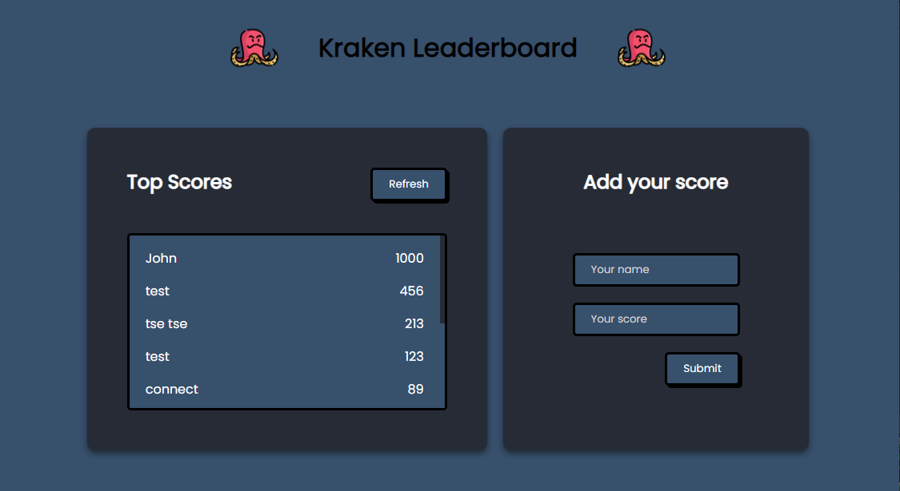

# Leaderboard

> Online Leaderboard for Kraken Game.



This is a demo web application where you can store the scores from your game and share the leaderboard with your friends.

## Built With

- HTML
- CSS
- JavaScript
- Webpack

## Live Demo

[Live Demo Link](https://awais-amjed.github.io/leaderboard/)

## Getting Started

To get a local copy up and running follow these simple example steps.

### Prerequisites

A Web Browser (preferably Google Chrome)

### Setup

- Clone the GitHub Repository
- Go to the Project Directory
- Run ```npm install```
- Run ```npm build``` to build the project

### Usage

- Run ```npm start``` to start the live server

## Authors

👤 **Author1**

- GitHub: [Awais Amjed](https://github.com/awais-amjed)
- Website: [Coding Fries](https://codingfries.com)
- LinkedIn: [LinkedIn](https://www.linkedin.com/in/awais-amjed)

## 🤝 Contributing

Contributions, issues, and feature requests are welcome!

Feel free to check the [issues page](../../issues/).

## Show your support

Give a ⭐️ if you like this project!

## Acknowledgments

- Microverse

## 📝 License

This project is [MIT](./LICENSE) licensed.